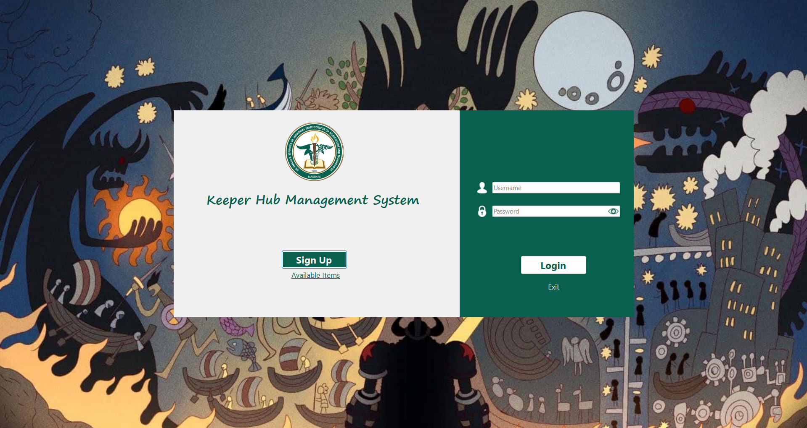
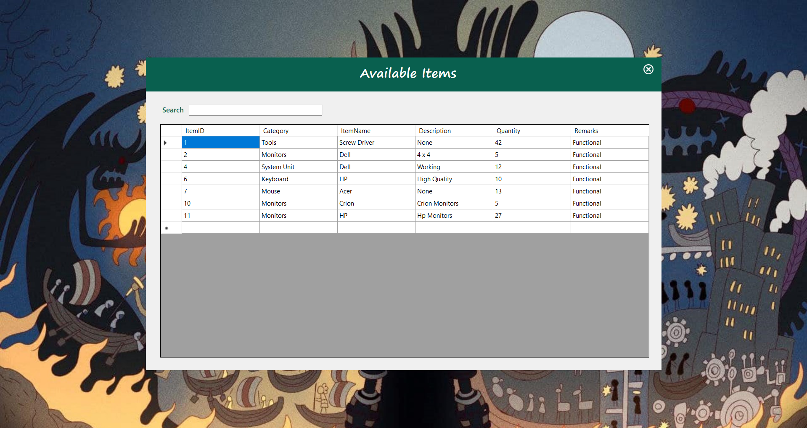
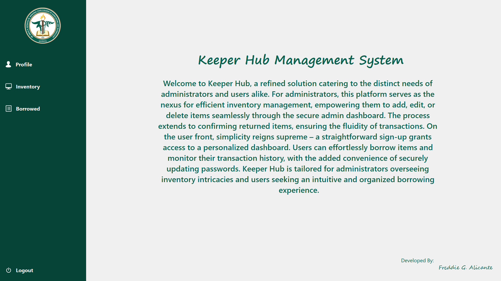
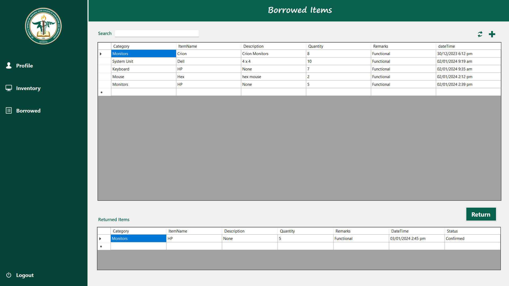
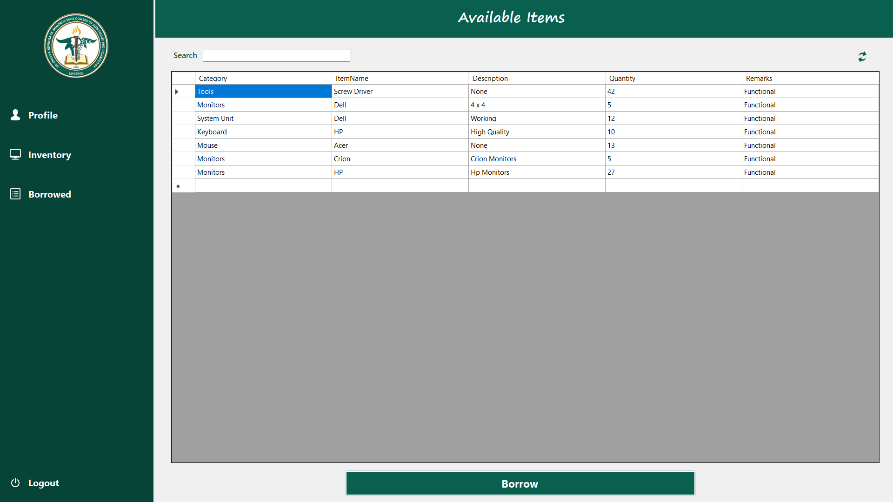
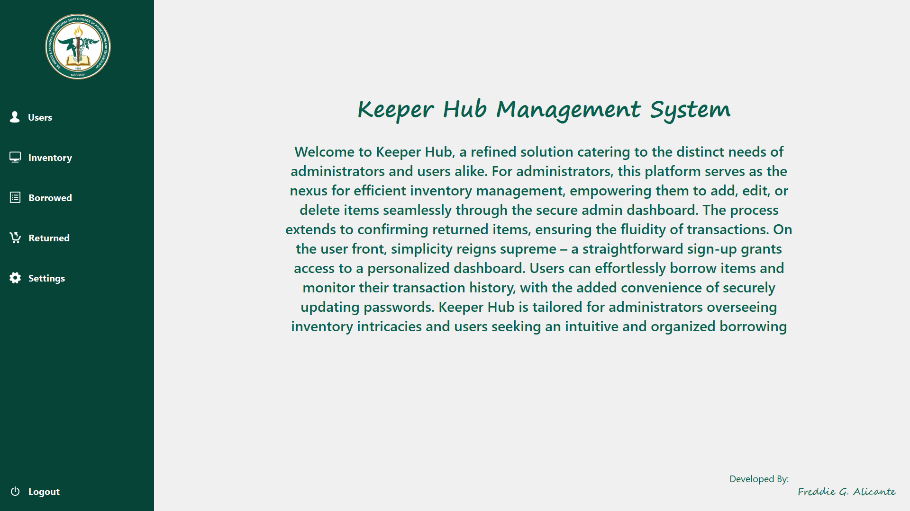
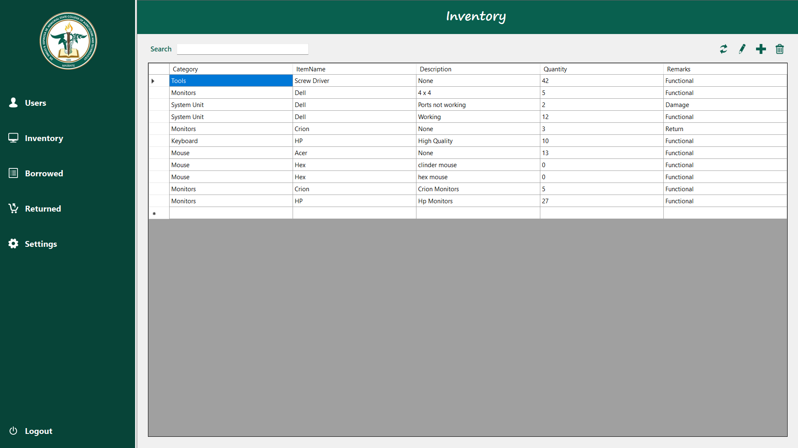
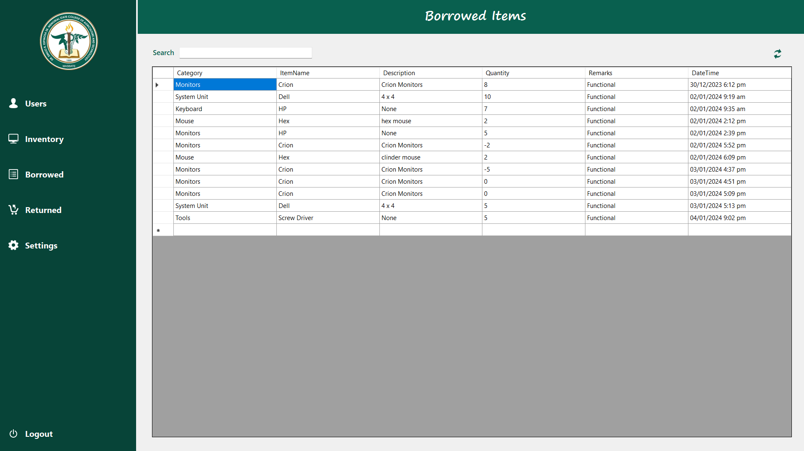

# 📦 Keeper Hub  
*A Cutting-edge Inventory & Borrowing Management System*  

> Developed by **Freddie G. Alicante**  

---

## ✨ Overview  
**Keeper Hub** is a modern **inventory and borrowing management system** designed for both **administrators** and **users**.  
It combines **efficiency** and **simplicity** in one system:  

- 🔑 **Admin Dashboard** – Manage inventory, confirm returns, and ensure system integrity.  
- 👤 **User Dashboard** – Borrow items, track transactions, and update passwords securely.  

Keeper Hub is more than a system – it’s a **digital hub of order and convenience** where efficiency meets elegance.  

---

## 🛠️ Features  

- 📊 **Admin Dashboard** – Oversee items, manage borrowing, confirm returns  
- 🧑‍💻 **User Access** – Easy borrowing and transaction history  
- 🔐 **Secure Accounts** – Manage passwords and user credentials  
- ⚡ **Simple Setup** – Works with XAMPP and SQL database integration  

---

## 🔑 Default Accounts  

### **Admin**
Username: admin |
Password: admin

### **Users**
- Username: 4431 | Password: gojo
- Username: 1234 | Password: kelzy
- Username: user | Password: luis
- Username: jn2873 | Password: henry

---

## 🚀 Getting Started  

### **1. Import the Database**  
1. Open **XAMPP** and start **Apache** + **MySQL**  
2. Go to **phpMyAdmin** → Import  
3. Choose file → select `keeper_hub.sql`  
4. Click **Import**  

### **2. Launch the System**  
1. Open the **Keeper Hub** project folder  
2. Locate and open `Keeper_Hub.sln`  
3. Click **Start** to run the system  

## 📸 User Interface Preview  

#### Login Page  
  
The login interface where users enter their credentials to access the system.  

#### Available Items  
  
Displays the list of items available for borrowing, with search and filter options.  

### User Pages  

#### User Dashboard  
  
Main user interface providing access to borrowing, returning, and profile management.  

#### Borrowed Items  
  
Shows items currently borrowed by the user, including dates and quantities.  

#### Returned Items  
  
Lists items that have been returned, with status and return timestamps.  

### Admin Pages

#### Inventory Management

Interface for managing inventory items and user accounts, including adding, editing, and overseeing accounts.

#### Borrowing Management

View for handling borrowing requests, confirming item loans, and managing return confirmations.

#### System Administration

Tools for generating reports, configuring system settings, and performing administrative tasks.

---

## 📂 Project Structure
```
Keeper_Hub/
├── .gitattributes
├── .gitignore
├── Keeper_Hub.sln
├── keeper_hub.sql
├── README.md
└── Keeper_Hub/
    ├── *.Designer.vb (UI designer files)
    ├── *.resx (resource files)
    ├── *.vb (Visual Basic source files)
    ├── bin/ (compiled binaries)
    ├── images/ (application icons and screenshots)
    │   ├── *.png (icons)
    │   └── readme_images/ (screenshots)
    ├── My Project/ (project settings)
    └── obj/ (build objects)
```

---

## 🗄️ Database Structure

The Keeper Hub system uses a MySQL database with the following key tables:

- **accounts**: Stores user account information including login credentials, roles, and personal details.
- **inventory**: Manages the list of available items with categories, descriptions, quantities, and remarks.
- **borrowed**: Tracks items currently borrowed by users, linking to users and inventory.
- **returned**: Records items that have been returned, including confirmation status.
- **history**: Maintains a log of all borrowing and returning transactions for auditing.

---

## 👨‍💻 Developer  
**Freddie G. Alicante**  

📌 *"Efficiency meets elegance in Keeper Hub."*  
